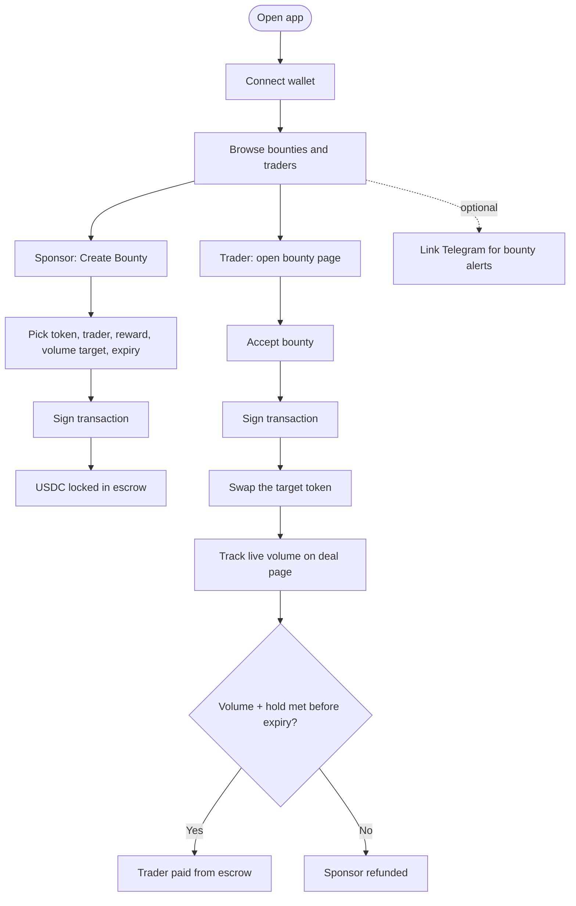
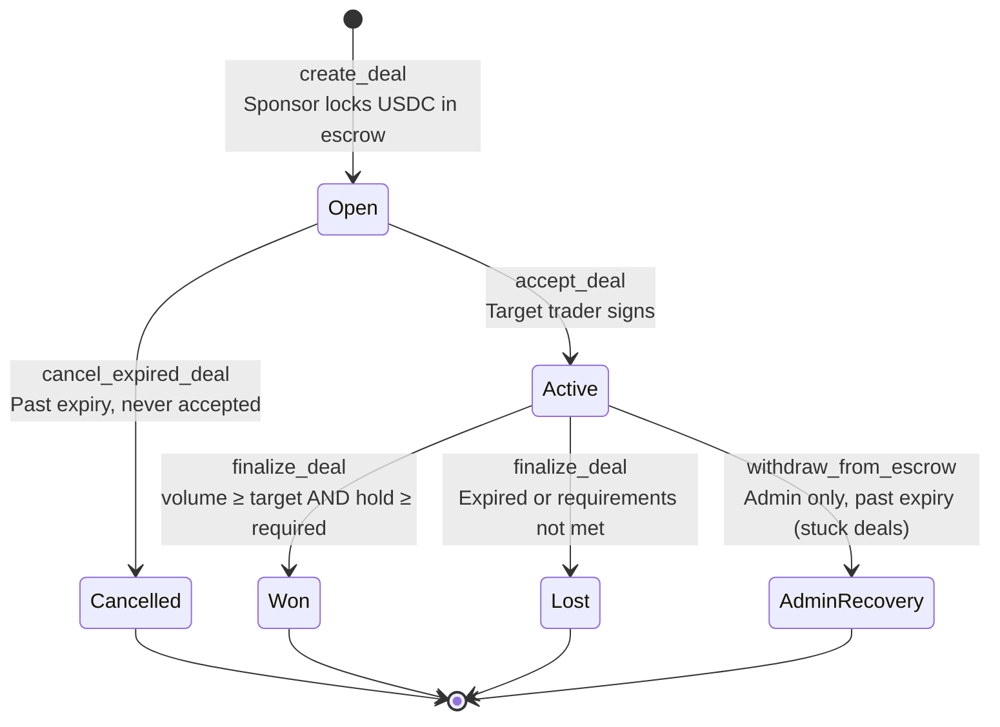
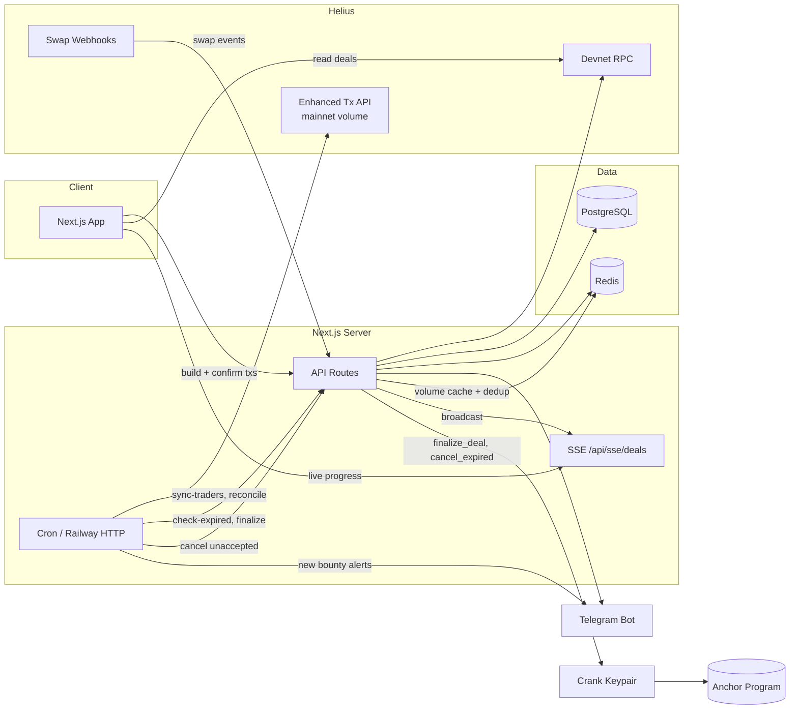

# Bounty Exchange

Performance-based USDC bounties for Solana token volume. A sponsor escrow-locks a reward against a specific trader wallet; the trader accepts, generates swap volume on a target mint, and gets paid on-chain if they hit volume and hold requirements before expiry.

## Problem

Token projects need measurable trading activity from known wallets (KOLs, market makers, traders). Off-platform deals have no escrow, no objective settlement, and no way to enforce volume or hold terms. Bounty Exchange wraps that arrangement in an Anchor program with USDC escrow and an off-chain volume oracle that feeds finalization.

## How It Works

1. **Create** (`create_deal`): Sponsor deposits USDC into a program-owned escrow vault and sets token mint, target trader, reward, volume target, optional min buy size, expiration window, and hold duration.
2. **Accept** (`accept_deal`): Only the designated trader can accept. Accepted deals sync to Postgres; the trader is registered on Helius webhooks for swap monitoring.
3. **Track**: Backend parses swap transactions via Helius Enhanced Transactions API, computes USD volume on the target mint, and caches results in Redis.
4. **Finalize** (`finalize_deal`): Authorized crank submits `volume_at_end_time` and `hold_duration_at_end_time`. Program pays the trader on pass or refunds the creator on fail. Unaccepted deals past expiry are cancelled permissionlessly (`cancel_expired_deal`).

Win condition: volume target **and** hold duration met before expiration. Early finalization triggers once both are satisfied.

## Architecture

Three views of the same system: what the user does, what the on-chain program enforces, and what the backend runs in the background.

### 1. App Flow



**Routes:** `/` marketplace · `/deal/[pubkey]` detail and accept · `/sponsor` dashboard · `/[wallet]/deals` trader board · `/verify/[code]` Telegram linking

Trader directory synced from Axiom (`scripts/syncAxiomTraders.ts`).

### 2. Program Logic

On-chain rules only. The program never parses DEX swaps. Volume and hold duration are attested off-chain and submitted at finalization by the authorized crank.



| Instruction | Signer | What it does |
|-------------|--------|--------------|
| `create_deal` | Sponsor | Inits Deal PDA + escrow; 10% fee to protocol wallet, reward to vault |
| `accept_deal` | Target trader | Sets `is_accepted = true` |
| `finalize_deal` | Crank (`CRANK_AUTHORITY`) | Pass → escrow to trader; fail → refund creator; closes vault |
| `cancel_expired_deal` | Anyone | Refunds creator if deal expired unaccepted |
| `withdraw_from_escrow` | Admin | Emergency recovery of stuck escrow |

Program ID: `5voynNZLcD5xDBmhfvegNK9ySLsjZRU4HdhmC5KQSaSi` (devnet)

### 3. Backend



**Key API paths**

| Path | Role |
|------|------|
| `/api/deal/create`, `/accept`, `/finalize`, `/cancel-expired` | Build or execute on-chain instructions |
| `/api/deal/confirmDealCreated`, `/confirmDealAccepted` | Sync Postgres + trigger notifications after wallet txs land |
| `/api/helius/webhook` | Real-time swap → volume increment → SSE |
| `/api/sse/deals` | Push volume updates to open deal pages |
| `/api/cron?job=...` | Production schedulers (volume sync, finalization, reconciliation) |
| `/api/telegram/*` | Bot webhook, wallet linking, notification prefs |

**Cron jobs** (in-process in dev via `instrumentation.ts`; Railway HTTP in prod when `CRON_SECRET` is set): volume sync every 3 min · finalization + cancel-expired every 1 min · on-chain reconciliation every 3 min · orphaned-deal cleanup hourly · daily Telegram summaries at 09:00 UTC.

Volume oracle reads **mainnet** swap history; deal escrow and settlement run on **devnet**.

## Stack

| Layer | Tech |
|-------|------|
| Frontend | Next.js 16, React 19, Tailwind, shadcn/ui, Solana Wallet Adapter (Phantom, Solflare) |
| On-chain | Anchor 0.32 (`bounty_exchange_program`), SPL Token (USDC escrow) |
| Backend | Next.js API routes, node-cron (dev) / Railway HTTP crons (prod) |
| Database | PostgreSQL via Prisma (Neon adapter) |
| Cache | Upstash Redis (in-memory fallback) |
| Notifications | Telegram Bot API (trader DMs + system channel) |
| Deploy | Railway |

### RPCs and External Services

| Service | Env var | Usage |
|---------|---------|-------|
| Helius Devnet RPC | `HELIUS_DEVNET_URL` / `NEXT_PUBLIC_HELIUS_DEVNET_URL` | Wallet txs, deal reads/writes, program interaction |
| Helius Mainnet RPC | `HELIUS_MAINNET_URL` | Token metadata |
| Helius Enhanced Transactions | `HELIUS_API_KEY`, `HELIUS_MAINNET_API_BASE` | Swap parsing and USD volume calculation |
| Helius Webhooks | `HELIUS_WEBHOOK_ID`, `DEV_HELIUS_WEBHOOK_ID`, `HELIUS_WEBHOOK_SECRET` | Real-time swap events on trader wallets |
| PostgreSQL | `DATABASE_URL` | Traders, deals, notification prefs/logs |
| Upstash Redis | `UPSTASH_REDIS_REST_URL`, `UPSTASH_REDIS_REST_TOKEN` | Volume cache |
| Crank keypair | `CRANK_PRIVATE_KEY` | Signs `finalize_deal` and cancel txs |
| Cron auth | `CRON_SECRET` | Protects `/api/cron` in production |

Program: `5voynNZLcD5xDBmhfvegNK9ySLsjZRU4HdhmC5KQSaSi` (devnet). USDC mint: `GqiwdrC5ybCCmtvG2Yir9CVfsENjYQTHwKB9B2y3mi5f`.

## Program Reference

The Anchor program is a blackbox relative to this repo. Integration happens through the checked-in IDL (`src/program/IDL.json`) and TS instruction builders (`src/program/instructions/`). Rust instruction sources are mirrored in `program/` for reference; canonical source is the program repo.

**Program repo:** [github.com/Shiva953/bounty-exchange-program](https://github.com/Shiva953/bounty-exchange-program)

See **Architecture §2** for the state diagram and instruction summary.

### Accounts

| Account | Derivation / role |
|---------|-------------------|
| **Deal PDA** | `seeds = ["deal", creator, deal_id_le_bytes]` |
| **Escrow vault** | USDC ATA, authority = Deal PDA |
| **Fee wallet** | Hardcoded `FEE_WALLET`, receives protocol fee at creation |

**Deal state** (`program/create_deal.rs`): `deal_id`, `creator`, `token` (target mint), `trader`, `reward_amount`, `target_volume`, `min_buy_volume`, `expiration_window_in_hours`, `hold_duration_in_hours`, `escrow_vault`, `created_at`, `is_active`, `is_accepted`, `outcome`, `volume_completed_usd`.

### Instructions

**`create_deal`** (sponsor signs)
- Inits Deal PDA + escrow ATA
- Validates: no self-target, reward >= 200 USDC, `min_buy_volume < target_volume`, expiry/hold between 1h and 720h, target volume cap
- Transfers **10% protocol fee** to `FEE_WALLET`, then full `reward_amount` to escrow

**`accept_deal`** (target trader signs)
- Requires `deal.trader == signer`, active, not yet accepted
- Sets `is_accepted = true`

**`finalize_deal`** (crank signs, must match hardcoded `CRANK_AUTHORITY`)
- Args: `volume_at_end_time`, `hold_duration_at_end_time` (supplied by off-chain oracle)
- Pass if `volume >= target_volume` **and** `hold_duration >= hold_duration_in_hours`
- **Pass:** full escrow to trader ATA, close vault, `outcome = true`
- **Fail:** full escrow to creator ATA, close vault, `outcome = false`
- Sets `is_active = false`, stores `volume_completed_usd`

**`cancel_expired_deal`** (permissionless, any payer)
- Only for unaccepted deals past `created_at + expiration_window`
- Refunds creator, closes escrow, sets `is_active = false`

**`withdraw_from_escrow`** (hardcoded `ADMIN` only)
- Active deal, only after expiration window elapsed
- Escrow to admin ATA (emergency recovery), closes vault

## Development

```bash
bun install
bun run dev          # Next.js on :3000
bun run bot:dev      # Telegram polling (local, no webhook)
bun run db:migrate   # Prisma migrations
```

In dev, cron runs in-process via `instrumentation.ts`. In production (`CRON_SECRET` set), Railway triggers `/api/cron?job=...` on schedule (volume sync, expiry checks, reconciliation, notifications).
